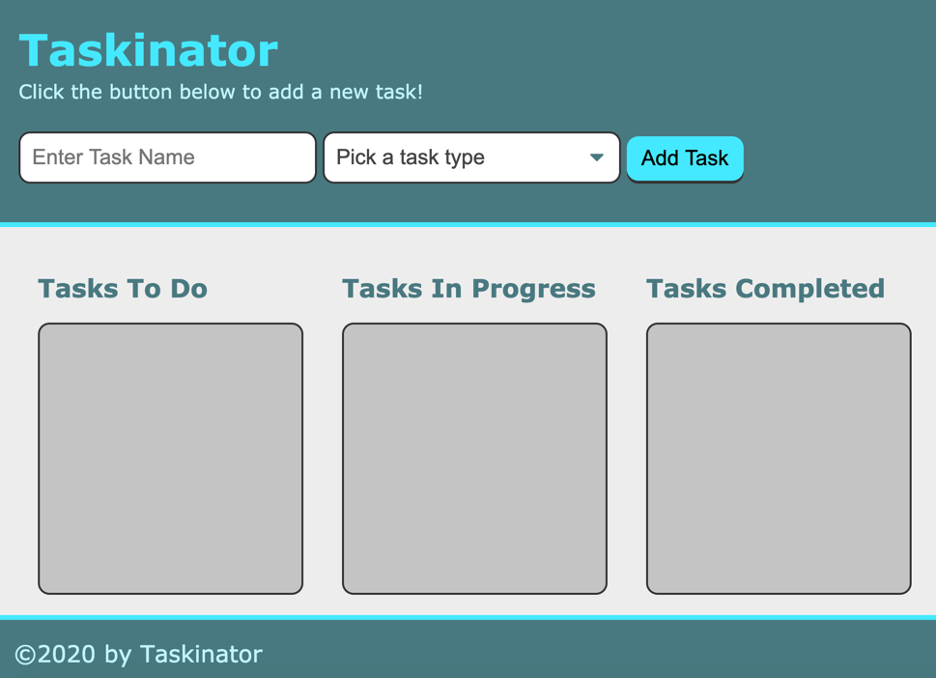

# TASKINATOR

## Purpose
Organize tasks in a Kanban style with a to-do, in progress, and completed. You can edit, delete and save even if closing the browser tab. 

## Languages
HTML, CSS, JavaScript

## Credits
Created by UofA Coding Bootcamp and refractored by Brandi Curley

## Link to webpage:
https://galacticnative.github.io/taskinator/

